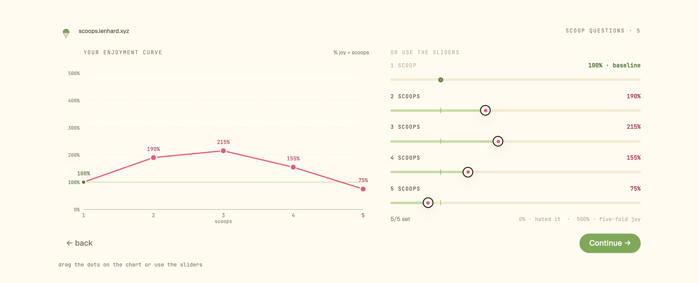
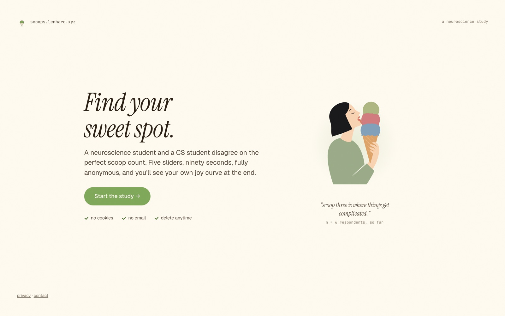
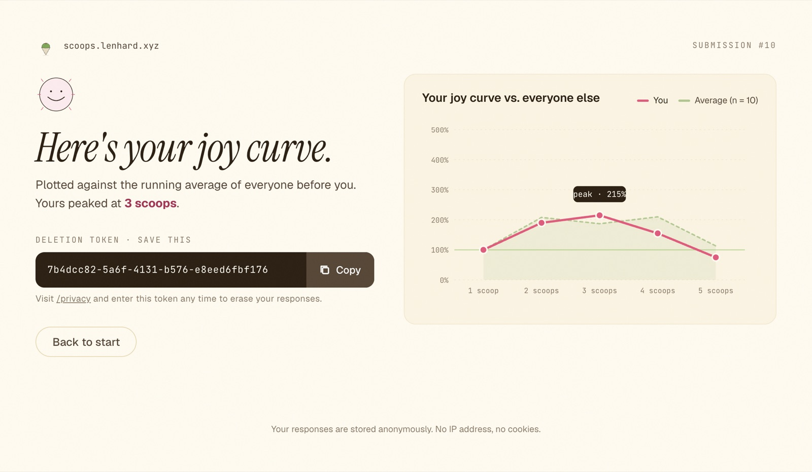
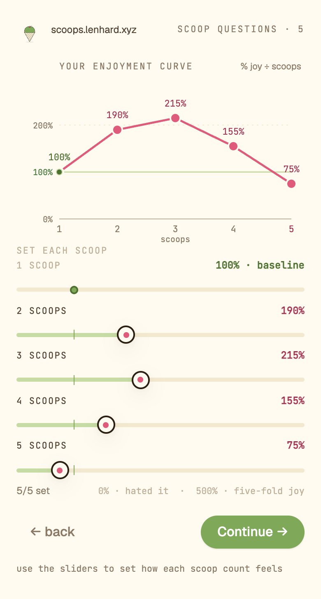
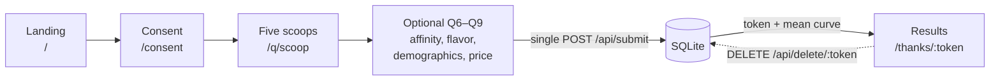

# Scoops

**Does a third scoop taste three times as good?**

A survey that measures the *marginal* utility of ice cream: how much joy each
additional scoop actually adds, and where the curve turns back down. Everyone
who finishes sees their own curve plotted against the running average of
everyone before them.

Live at **[scoops.lenhard.xyz](https://scoops.lenhard.xyz)**.



## Why this exists

A neuroscience student and a CS student disagreed about the perfect scoop
count. That is a hard argument to settle from an armchair.

The measurement problem turned out to be more interesting than the
disagreement. Asking "how much do you like ice cream?" gives you a number that
means nothing across people, because nobody's 7-out-of-10 is anyone else's. So
the survey anchors instead: one scoop is fixed at 100%, your own personal
baseline, and every larger serving is placed relative to it. Rating a
five-scoop cone at 75% is a specific, comparable claim — that the fifth scoop
left you worse off than a single scoop would have. Anchored that way, curves
from different people can be averaged without pretending their scales match.

The sample is still far too small to conclude anything, and the README will not
pretend otherwise.

## What it does

- **Five anchored ratings.** One scoop is locked at 100%. Scoops two through
  five are set anywhere from 0% (hated it) to 500% (five-fold joy), by dragging
  points on the chart or using the sliders. The chart is the input, not a
  readout of it.
- **Four optional questions.** Dessert affinity on a 1–10 scale, one forced
  flavor choice, age bracket and gender, and the most you would pay for your
  ideal cone in EUR, USD, or NOK. Every one of them is skippable.
- **A result worth staying for.** Your curve against the running average, with
  your peak annotated.
- **Deletion without accounts.** Submitting returns a token. Enter it at
  `/privacy` and the row is gone. It is the only handle that exists, because
  nothing else about you was stored.
- **An admin dashboard** at `/admin` with summary stats, a filterable list, and
  CSV/JSON export.

| | |
|---|---|
|  |  |
| The landing page | The results page |



*The results screenshot is from a local instance, so its respondent count does
not match the live site's.*

## How it fits together

An npm workspaces monorepo: a Vite/React SPA in `client/`, an Express API in
`server/`, about 4,000 lines of source between them.



Survey answers live in `sessionStorage` via
[`SurveyContext`](client/src/SurveyContext.jsx) until the very end. There is no
server-side session for the survey, no partial writes, and no per-question
requests. One `POST` at the end is the only write the whole flow makes.

| Endpoint | Purpose |
|---|---|
| `GET /api/count` | Respondent count for the landing page |
| `GET /api/price-stats` | Median and p10–p90 willingness to pay |
| `POST /api/submit` | The single write. Returns `{ token, mean, total }` |
| `DELETE /api/delete/:token` | Self-service deletion |
| `POST /api/admin/login` · `logout` · `GET me` | Session auth |
| `GET /api/admin/stats` · `submissions` | Dashboard data |
| `GET /api/admin/export.csv` · `export.json` | Export |
| `DELETE /api/admin/submissions/:token` | Admin deletion |

## Engineering decisions

### The chart is hand-written SVG because the chart library broke the router

The enjoyment curve started out as [recharts](https://recharts.org). Under
recharts 3.x, its internal `ResizeObserver` fell into an infinite
`width(-1)/height(-1)` measurement loop whenever the chart re-rendered during a
route transition. That loop starved React's commit phase, so the next page
never mounted — a blank screen mid-survey — and with Framer Motion in the tree
it also corrupted an animation ref (`Cannot assign to read only property
'current'`).

Replacing it with about 100 lines of hand-written SVG
([`JoyChart`](client/src/pages/ScoopSurvey.jsx)) removed the observer and the
loop together. The cost is real: no tooltips, no legend, no axis niceties
except the ones written by hand, and the drag maths is now this project's
problem. The gains were a survey that reaches the end, full control over
pointer behaviour on a chart that is an *input*, and a 90 kB gzipped JS bundle.

### Privacy is enforced in middleware, not in a policy document

[`stripIp`](server/src/middleware/privacy.js) runs before every other handler.
It overwrites `req.socket.remoteAddress` with `0.0.0.0` and deletes
`x-forwarded-for`, `x-real-ip`, and `cf-connecting-ip`. By the time any route
or logger sees the request, there is no address left to record. The point is
that "we don't log IPs" is a promise you have to keep every time you add a
logger, whereas this is structural.

`created_at` stores a date, not a timestamp, so submissions cannot be
correlated by arrival time. The survey sets no cookies at all; the only cookie
in the app is the admin session. Responses carry no identifier other than the
UUID handed back for deletion.

### Mobile gets a different chart, not a smaller one

Below 620px the chart becomes read-only and the sliders take over as the input.
Two reasons. A vertical drag on the chart competes with page scroll, and on
touch the chart usually loses. And once the sliders are visible on a narrow
screen, keeping both interactive means asking for the same five values twice.

The mobile chart also auto-fits its Y axis. At the full 0–500% range, the
default flat 100% curve renders as a line pinned to the bottom fifth of an
empty frame, which reads as broken rather than as a starting point.

### Exchange rates are frozen constants

Price answers are converted to USD with hard-coded rates
([`TO_USD`](server/src/routes/submissions.js)). No API call, no key to rotate,
no third-party dependency in the submit path, and the server stays useful
offline. The original amount and its currency are stored alongside the
converted value, so the raw answer survives even when the rate does not.

The rates do drift, and they are currently duplicated between the server and
[`PriceQuestion`](client/src/pages/PriceQuestion.jsx), so changing one means
remembering to change the other. For a survey about ice cream prices this is an
acceptable trade; for anything financial it would not be.

## Running it locally

Requires Node 20+ (the server uses `node --watch`).

```bash
npm install
cp server/.env.example server/.env
```

Fill in `server/.env`:

- `ADMIN_PASSWORD_HASH` — generate with
  `node -e "require('bcryptjs').hash('yourpassword', 12).then(console.log)"`.
  Leave it empty and every admin login fails, which is the intended default.
- `SECRET_KEY` — a long random string. **There is no startup guard**, so if you
  leave it unset in production the app silently falls back to a development
  default and admin sessions become forgeable. Set it.

```bash
npm run dev
```

Vite serves the client on `:5173` and proxies `/api` to Express on `:3001`. The
SQLite file is created on first boot at `server/instance/icecream.db`.

For production, `npm run build` then `npm start` — Express serves the built
client and the API together on one port.

## Known limitations

- **The bot heuristic has never fired.** `is_likely_bot` flags submissions whose
  five values exactly match `[200, 300, 400, 500, 600]`. That array has been
  unreachable since the first commit: the scale has always topped out at 500, so
  the API rejects the 600, and the current UI additionally locks scoop one at
  100. No row has ever been flagged, which makes the `WHERE is_likely_bot = 0`
  filters in the aggregate queries no-ops. It wants rewriting against values the
  UI can actually produce, not deleting.
- **`country` is never collected.** The column, its validation, the admin
  filter, and the CSV column all exist; no page ever sets the value, so it is
  always null.
- **CSV export omits `currency` and `max_price_original`.** Exports lose the
  original-currency price, which is exactly what those columns were added to
  preserve. JSON export is unaffected.
- **No tests.** The recharts failure above was found by clicking through the
  survey, which is a poor substitute for a regression test.
- **The sample is small.** Treat anything the dashboard shows as a shape, not a
  finding.

## Design

`design/Icecream/` holds the original JSX design prototypes. They are not
production code and are not built or deployed; the components under
`client/src/` were ported from them by hand, and the prototypes remain the
reference for visual decisions.

---

No license file yet, so default copyright applies. Questions:
[contact@lenhard.xyz](mailto:contact@lenhard.xyz)
